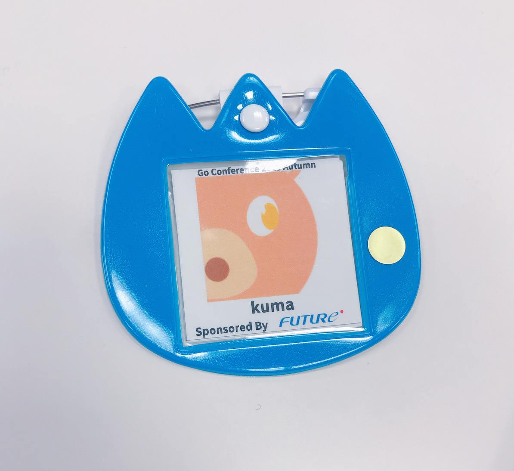
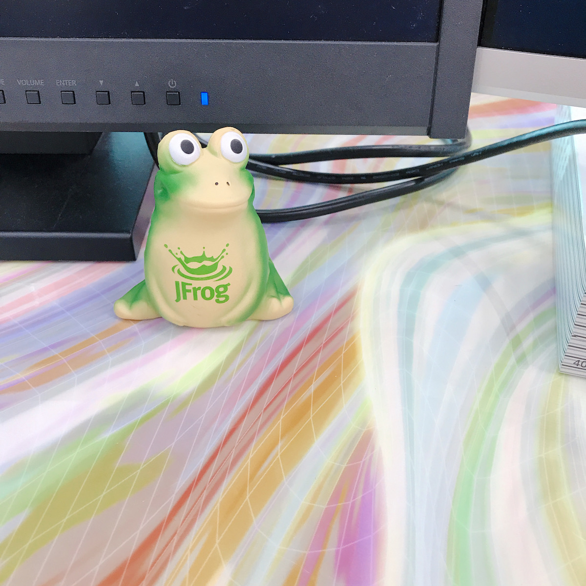

[Go Conference2019 Autumn](https://gocon.connpass.com/event/148602/)に参加してきたʕ◔ϖ◔ʔ 

すべてのセッションを見ることができなかったので個人的なまとめ

## セッション

### Go GC algorithm 101

> Everyone has once been told by their parents to “clean up your room!!”. But Go’s Runtime doesn’t say that. Why not? I will talk about the Garbage Collection algorithm that Go performs at the back of our program.

<iframe src="https://speakerdeck.com/player/d7c959521ae545e092ae4638c1756033" style="border: 0; top: 0; left: 0; width: 100%; height: 100%; position: absolute;" allowfullscreen scrolling="no" allow="encrypted-media"></iframe>

### Goptuna: Distributed Bayesian Optimization Framework.

>機械学習モデルのハイパーパラメータ探索を軸に研究が続けられてきたベイズ最適化は、入力とその評価値さえ設計できればあらゆるものが効率的に最適化できるため、近年は映像コーデックのエンコードパラメーターやJITコンパイラのパラメーターなど機械学習以外の分野にもその活用が広がっています。

>本セッションでは、代表的なベイズ最適化手法を紹介した後、筆者が開発・公開しているoptunaというGoのベイズ最適化ライブラリの使い方を応用事例とともに紹介します。みなさんが経験則をもとに設定しているあらゆるパラメーターが、ベイズ最適化によって、より効率的なものに変わっていくきっかけになればと思います。

<iframe src="https://www.slideshare.net/slideshow/embed_code/key/h3YmuakZjUbZ7c" style="border: 0; top: 0; left: 0; width: 100%; height: 100%; position: absolute;" allowfullscreen scrolling="no" allow="encrypted-media"></iframe>

### GoにおけるAPI Client実装パターン

>マイクロサービスアーキテクチャによる開発が普及してきている現在、REST APIにおけるHTTPリクエスト処理が求められる場面は多い。その際、APIリクエストに関する重要な概念を理解し、Clientとして適切に実装することが求められる。

>本発表では、マイクロサービス間のデータ連携システムを開発・運用した経験を持つ発表者が、HTTPリクエスト処理に関する「重要な概念とGoにおける実装パターン」や「よくある実装パターン」について述べる。

<iframe src="https://speakerdeck.com/player/e7c74b529e664c94b1a0517cb2f3bb79" style="border: 0; top: 0; left: 0; width: 100%; height: 100%; position: absolute;" allowfullscreen scrolling="no" allow="encrypted-media"></iframe>

### gotestsから学ぶテストコード自動生成のメカニズム

> テストコードの自動生成は、自動テストを効率的に実装するために重要な技術です。
> このトークでは、gotestsというテーブル駆動テストを自動生成するライブラリの実装を参考に、テストコード自動生成のメカニズムを紹介します。
> さらにそのメカニズムを活用して、より自分たちのプロジェクトに適したテストコードを生成できるように、テンプレートをカスタマイズする方法を解説します。

<iframe src="https://speakerdeck.com/player/5fc91a5f93844c38ad0c311459f8eaed" style="border: 0; top: 0; left: 0; width: 100%; height: 100%; position: absolute;" allowfullscreen scrolling="no" allow="encrypted-media"></iframe>

### OSS Performance Tuning Tips

> GoのOSSにPerformanceのPatchを投げるときの取り組み方を実際の事例ベースで紹介します. Breaking Changeをせずにパフォーマンス問題を解決するために何をやっているか (sync.Poolを使う, structにPoolを持つような拡張を施す(image/png.Encoder go1.9~), bufをメンバとして持ってReset可能な作りにする, 明示的にbufを渡す関数(io.Copy, io.CopyBuffer)も提供する, チューニングの制約にならないためにpublicな関数は減らす), go-gitやgo本体へ投げたPatchの紹介もします.

<iframe src="https://speakerdeck.com/player/b73deb0cc6cc460f9c535d1b7bbde70e" style="border: 0; top: 0; left: 0; width: 100%; height: 100%; position: absolute;" allowfullscreen scrolling="no" allow="encrypted-media"></iframe>

### API scenario testing tool with plugin package

> マイクロサービスアーキテクチャで各チームが独立して開発をすすめていると、ある変更によって思わぬところに影響を与えてしまうことがあります。それを防ぐために、例えばEnd-to-Endのシナリオテストを利用することができます。今回私はGo標準のpluginパッケージを使って、YAMLで簡単にシナリオが書けるプラガブルなテスト用ツールを作成しました。このセッションではそのツールの紹介と、作成する上で工夫した点についてお話しします。

<iframe src="https://docs.google.com/presentation/d/1SXNNuZLt1CKNrhgkOYYs1LA7iYlOuJENCSovaOMciPA/preview?usp=embed_googleplus" style="border: 0; top: 0; left: 0; width: 100%; height: 100%; position: absolute;" allowfullscreen scrolling="no" allow="encrypted-media"></iframe>

### Accelerate Go development with Bazel

> Bazel は、全く新しいビルドツールチェーンというわけではありませんが、確たるユースケースが存在しシェアを伸ばしつつあります。 Tensorflow、Envoy 、Protocol Buffers など有名 OSS が主たる例です。 Go での活用も Kubernetes などで見られます。 Bazel を利用することで、我々は高速かつ高い再現性を持つビルドを行ったり、ワークスペースを汚染せずに済んだり、 Docker Image をビルドしたりプッシュしたり出来ます。 本セッションでは、Go プロジェクトになぜ、どのように Bazel を導入するのかを紹介します。

<iframe src="https://speakerdeck.com/player/94d549714b784142829e9de67a0b12cb" style="border: 0; top: 0; left: 0; width: 100%; height: 100%; position: absolute;" allowfullscreen scrolling="no" allow="encrypted-media"></iframe>

### Suggestions and techniques for building neural networks with Go

> Goで単語をベクトル化するためのニューラルネットワーク「Word2Vec」 をスクラッチで構築した経験から、Goでニューラルネットワークを組む際のエッセンスについてお話しします。「Go+ニューラルネットワーク」と言う組み合わせはあまりイメージが無いかもしれませんが、仕組みと行列計算のクセを理解すれば難しくはありません。Goによる行列計算の現状と今後についてのお話はもちろん、Goでニューラルネットワークを組む際のアーキテクチャの考え方や、数値計算のテスト方法やモデルの保存方法などを紹介します。このトークで「Goでもデータサイエンスできそう！」と思ってもらうことが今回のトークのゴールです。

<iframe src="https://speakerdeck.com/player/39224bdfa22242f9a24fd327008f420c" style="border: 0; top: 0; left: 0; width: 100%; height: 100%; position: absolute;" allowfullscreen scrolling="no" allow="encrypted-media"></iframe>

### Multi-cloud portability for Go applications

> Developers love Go for cloud development because of its efficiency, productivity, built-in concurrency, and low latency. One common theme with many organisations is the need for portability across cloud providers. This talk deep dives into architecting multi-cloud Go applications with go-cloud.

### How to develop "Container/Kubernetes Ready" Go web Application?

> モダンなアプリケーション開発においてコンテナ技術の利用はもっとも有効な選択肢の一つである。
> また、コンテナ型のプラットフォームの代表であるDockerや、コンテナ・オーケストレーションツールであるKubernetesなどコンテナに関わるプロダクトの多くはGo言語によって開発されている。
> しかし、Kubernetesなどのコンテナ環境を前提としたアプリケーション開発ではその他の環境には無い注意点が存在する。このTalkでは、Kubernetes上で行うGo言語アプリケーションの開発におけるTipsを紹介し、よりモダンなアプリケーション開発に必要な知識を共有する。

<iframe src="https://speakerdeck.com/player/05df229eab964ec0b86c773175876224" style="border: 0; top: 0; left: 0; width: 100%; height: 100%; position: absolute;" allowfullscreen scrolling="no" allow="encrypted-media"></iframe>

### GoでDockerイメージを解析してCIを改善する方法

> 最近、AquaSecurityに買収され話題になったTrivyや、拙作のDockleはDockerイメージを静的解析して、状態をチェックするツールです。
> このツールを支えるfanalというライブラリを使うと、自分が利用しているDockerイメージを簡単に解析できます。そして、あなたのCI上で独自のチェックルールを作成することができるようになります。
> 発表では実際に、ファイルの存在チェックやnginx.confの書式チェックを行うためのプロジェクトを作成します。

<iframe src="https://speakerdeck.com/player/942dab5bf6c240d3a22f498a481ec225" style="border: 0; top: 0; left: 0; width: 100%; height: 100%; position: absolute;" allowfullscreen scrolling="no" allow="encrypted-media"></iframe>

### Golangで並行シミュレーテッドアニーリング

> メタヒューリスティクスの手法のひとつであるシミュレーテッドアニーリングは様々な最適化問題へ応用することができる汎用アルゴリズムです。 良質な解を得るためには十分な計算時間が必要であり、様々な並行化の研究があります。 私は温度並列シミュレーテッドアニーリング(TPSA)をGolangで実装しました。Golangの並行機構とマッチして、自然にTPSAを実装することができます。 また、巡回セールスマン問題にTPSAを適用したときに良質な結果が得られたことを示します。あわせてgonum/plotパッケージとWebsocketを組み合わせて、ブラウザ上でリアルタイムに解が収束する過程を確認します。

<iframe src="https://speakerdeck.com/player/01855be763dc46f18bfba1cf8d60f147" style="border: 0; top: 0; left: 0; width: 100%; height: 100%; position: absolute;" allowfullscreen scrolling="no" allow="encrypted-media"></iframe>

### Microsoft Graph API Library for Go

> In this talk I’ll share my recent effort to implement the Microsoft Graph API library for Go. It includes brief explanation on the strategy to translate API spec to actual library code and the utilization of Go specific features like interface, type embedding, and code generating infrastructure.

<iframe src="https://www.slideshare.net/slideshow/embed_code/key/it5U1ik7xCiBfX" style="border: 0; top: 0; left: 0; width: 100%; height: 100%; position: absolute;" allowfullscreen scrolling="no" allow="encrypted-media"></iframe>

### Continuous Go Fuzzing

> Fuzzing or fuzz testing is an automated software testing technique that involves providing semi-random data as input to test programs.
> We will discuss how fuzzing helps with security, stability and performance in Go. As well as how to integrate it into the CI and overcome challenges.

<iframe src="https://www.youtube.com/embed/koUmZFK7LP0?rel=0" style="border: 0; top: 0; left: 0; width: 100%; height: 100%; position: absolute;" allowfullscreen scrolling="no" allow="encrypted-media; accelerometer; gyroscope; picture-in-picture"></iframe>

### Go で"超高速"な経路探索エンジンをつくる

> カーナビはどうしてあれほど運転ルートを高速に計算できるか、気になったことはありませんか？
> 本トークでは、 実際にGoで”“超高速”“な経路探索エンジンを作成したときに用いた、アルゴリズムと実装時の工夫・チューニングを紹介します。まず経路探索アルゴリズムはどういったものか、前提知識不要で説明します(ダイクストラ、Contraction Hierarchies )。次に Go で実装する上で必要になる、高速に巨大なサイズの slice や map を扱う工夫を紹介します。経路探索を題材に、Go の slice や map の仕組み、そして高速に扱う工夫を持ち帰っていただければ幸いです。

<iframe src="https://speakerdeck.com/player/1a98b4f5541a4b139531f8c1bf755a70" style="border: 0; top: 0; left: 0; width: 100%; height: 100%; position: absolute;" allowfullscreen scrolling="no" allow="encrypted-media"></iframe>

### Goでつくるゲームボーイエミュレータ、またはブラウザでの動かし方

> Goを学ぶためにGoでゲームボーイエミュレータを書いてみたため、ゲームボーイエミュレータの作り方についてお話しさせていただきたいと思います。またGoで書かれたエミュレータをWebAssemblyに変換しブラウザで動作させることに成功したため、ブラウザで動かすためにどのようなことを行なったかについても話せればと思います。

<iframe src="https://speakerdeck.com/player/bcee18d17aa24a5c82862dfcf93f74ae" style="border: 0; top: 0; left: 0; width: 100%; height: 100%; position: absolute;" allowfullscreen scrolling="no" allow="encrypted-media"></iframe>

### Schema first approach to GraphQL server development in Go

GraphQL is expanding its area toward a replacement of ORM as you can see in Prisma and AppSync.
There are some good modules of Go but they varies in design approaches.
In this talk, I will describe those differences and show how to develop in a schema-first approach by making the best use of Go.

<iframe src="https://speakerdeck.com/player/9a6ec9d9de3d4f1ebcf994d1d17612fc" style="border: 0; top: 0; left: 0; width: 100%; height: 100%; position: absolute;" allowfullscreen scrolling="no" allow="encrypted-media"></iframe>

### Welcome to Linter

> チーム開発を行う際、コードの統一性を保っておくと、新規メンバーが入ってきた時にキャッチアップが早くなったり、より高いコンテキストでコードレビューを行うことができます。
> Go言語においては静的解析を行う為のツールセットが言語側で提供されているので、他の言語に比べて非常に敷居が低いです。
> この入門セッションでは、コードの統一性を静的解析を行うことで解決できるようにする静的解析ツールを開発する為の入門セッションです。

<iframe src="https://speakerdeck.com/player/141561e348cc454283a69d5823b944e3" style="border: 0; top: 0; left: 0; width: 100%; height: 100%; position: absolute;" allowfullscreen scrolling="no" allow="encrypted-media"></iframe>

### Goコンパイラをゼロから作ってセルフホスト達成するまで

> Go(のサブセット言語)コンパイラをゼロから作ってセルフホストを達成しました。
> Goでスクラッチからのセルフホスト達成は世界初と言われています。(自分調べ)
> 本トークでは、Go言語やコンパイラにそれほど詳しくなかった私が、これを達成するまでに辿った道のりを紹介します。

<iframe src="https://speakerdeck.com/player/ffa87e2ea82043198af61c82322efec1" style="border: 0; top: 0; left: 0; width: 100%; height: 100%; position: absolute;" allowfullscreen scrolling="no" allow="encrypted-media"></iframe>

### Write Container Runtime in Go

> 昨今では、DockerやKubernetesは多くのプロダクションで採用されています。そしてコンテナランタイムはこれらの技術を支える、正に中心的な技術です。このトークではrunCなどの各コンテナランタイムのGoのコードを紹介しながら、コンテナランタイムについて話します。またOCIが定めるOCI runtimeについてを、自作のコンテナランタイムをそれに準拠させながら話します。このトークの後で実際に自身の手でコンテナランタイムの自作、OCI runtimeへの準拠ができるように、GitHubにログ付きのレポジトリーを公開する予定です。

## LT

### Recipe to adopt Go modules in 5 minutes

> Adopting Go modules is not easy especially if projects that have been around for a while. In Go 1.13, Go modules will be enabled by default and we want to share 5 steps that will help project authors adopt Go modules.

### Go1.13以後のエラーハンドリングについて語ろう

> これまでの error は、それがどこで発生したのか関数呼び出しを辿らなければ容易に判別できませんでした。Go1.13からは、標準パッケージ errors にスタックトレースを追うための機能が加わり、多くの Gopher がこの機能を使い始めます。本セッションでは、新しく追加された機能の紹介をし、その機能を使う上での注意点をお話しします。

<iframe src="https://speakerdeck.com/player/723cc721daa94eb781f4aa442c6b8f2b" style="border: 0; top: 0; left: 0; width: 100%; height: 100%; position: absolute;" allowfullscreen scrolling="no" allow="encrypted-media"></iframe>

### GoのWebアプリケーション開発でのDB関連トラブル for Beginners

> Webアプリケーションを開発するにあたり、DBに関してはトラブルが付き物です。
> 特に弊社では知見が足りない状態でDBを扱ったため様々なDBトラブルをここ一年で起こしてきました。それらを説明することにより、同じトラブルに出会う事のないように起きたケースとその対処方を説明します。

<iframe src="https://docs.google.com/presentation/d/1mhvMIUmwyIcimLkVWY7x9ffwQ24bu-87-f8_KM5aaZw/preview?usp=embed_googleplus" style="border: 0; top: 0; left: 0; width: 100%; height: 100%; position: absolute;" allowfullscreen scrolling="no" allow="encrypted-media"></iframe>

### はじめてのプログラミングに Go

> Women Who Go Tokyo は毎月1回、Go の勉強会をしており、はじめてプログラムに触れる方、初学者の方もいらっしゃいます。
> はじめてのプログラミングに何故 Go が向いていると考えているか。そしてどんなステップアップができて、日常に役立つところ。
> そんな話ができたら…と思います

### Using Go plugins

> Go 1.8リリース直前の2016年12月にQiitaにてGoプラグイン機能のコーディング例を紹介しましたが現在まで目立った話題が見当たりません。改めて紹介することでユーザーへの本機能の利用頻度の向上や有用性の見直しを図ります。

### Considering the introduction of the anonymous function syntax sugar into Go

> Tried to implement anonymous syntax sugar as reference, and considered what advantages and problems there are.
> This talk describes it is really needed for Go or what form if it should be.

<iframe src="https://speakerdeck.com/player/7d38b3f6ba174109a9ede3966b5f3590" style="border: 0; top: 0; left: 0; width: 100%; height: 100%; position: absolute;" allowfullscreen scrolling="no" allow="encrypted-media"></iframe>

### 今からはじめるWebAssembly

> Go1.11からサポートされたWebAssemblyについて、始め方やその実装方法など今出ている情報についてまとめてみたいと考えています。

<iframe src="https://docs.google.com/presentation/d/1QsOx_XEG8Wk12FSY-H-h8DWAEq7amRWoIOIHbK90J7s/preview?usp=embed_googleplus" style="border: 0; top: 0; left: 0; width: 100%; height: 100%; position: absolute;" allowfullscreen scrolling="no" allow="encrypted-media"></iframe>

## そのた

- [Togetter](https://togetter.com/li/1422757)
  - togetterまとめ
- [Codelabs](https://dena.github.io/codelabs/)
  - 社内Gopher向けCodelabsを一部公開してくれたらしい

#### おわりに
発表者・運営・スポンサーのみなさまありがとうございました。いち参加者でしたが楽しむことができました。

JFrogのカエルさんをもらったので、会社で見守ってくれてる🐸

