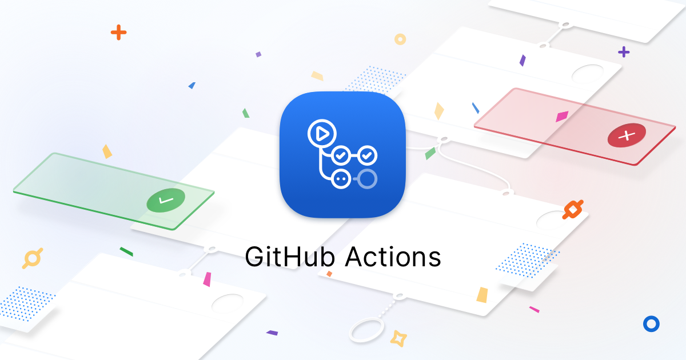
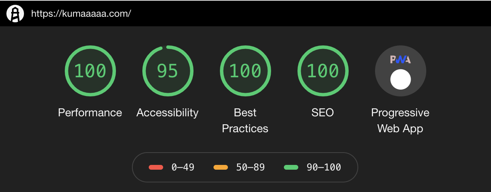

ブログはじめました🎉

これで一人前のエンジニアだね！

## いろんなことを書いていくよ
技術的なことを中心に、デザイン・組織のことまで様々。とにかく書きたいと思ったことをゆるーく書いてく。

アウトプットは大事だしね

## ブログの技術的なお話
ここからは技術のお話。

このブログは[Gatsby](https://www.gatsbyjs.org/)で作った。GatsbyはReact製の静的サイトジェネレータで、Markdownでらくーに記事を書くこともできるし、HeadlessCMSを使ってJAMSstackな構成でイマドキのイケイケブログみたいなこともできる。 そうやって作った記事をGraphQLクエリを通じて組み込める。プラグインも豊富でカスタマイズもしやすいのでサイコーって感じ。

### Gatsby × TypeScript
やっぱり静的型付けはDX最高なのでTypeScriptにした。

でも結構めんどくさいところもあってGraphQLを使ってるので、型定義がだるい...

そんな煩わしさを解決する為に、[GraphQL Code Generator](https://graphql-code-generator.com/)を使った。これはGraphQL schemaを元にTypeScriptの型定義を自動で生成してくれる。Gatsby自体Reactコンポーネント内のGraphQLクエリからスキーマを自動生成してくれるので相性抜群！！ここら辺のことは、また記事にしたいと思う。

### GitHub Actions


まだベータ版だけど、使ってみた。今回使ったのはLintとか簡単なことだけどcronみたいなスケジューラもできたりする。使いにくいところも多少あるけど今後期待できそう。


### Gatsbyプラグイン
結構いろんなプラグインにお世話になった。以下はConfigファイルから抜粋。

PWAも簡単に作れるし、今度はAMPに対応したいなーと思ったりしてる
```javascript:title=gatsby-config.js
module.exports = {
  plugins: [
    `gatsby-plugin-typescript`,
    `gatsby-plugin-react-helmet`,
    `gatsby-plugin-emotion`,
    `gatsby-source-filesystem`,
    `gatsby-transformer-sharp`,
    `gatsby-plugin-sharp`,
    `gatsby-plugin-manifest`,
    `gatsby-plugin-sitemap`,
    `gatsby-plugin-google-analytics`,
    `gatsby-plugin-twitter`,
    `gatsby-plugin-offline`,
    `gatsby-plugin-netlify`,
    `gatsby-plugin-feed`,
    {
      resolve: `gatsby-transformer-remark`,
      options: {
        plugins: [
          `gatsby-remark-code-titles`,
          `gatsby-remark-prismjs`,
        ],
      },
    },
    {
      resolve: `gatsby-plugin-postcss`,
      options: {
        postCssPlugins: [require(`postcss-nested`)],
      },
    },
  ],
}

```


### Algolia
Algoliaは全文検索機能を提供してくれるSaaS。React向けに検索UIを提供する[React InstantSearch](https://www.algolia.com/doc/guides/building-search-ui/what-is-instantsearch/react/) やAlgoliaに記事を登録してくれるGatsbyプラグイン`gatsby-plugin-algolia`があるので容易に組み込める。

もうすこし記事数が増えたら組み込もうと思う

## デザインなお話
シンプルで邪魔のないUIを目指した。ブログの本質は記事を見ることだしね

トップページはシンプルすぎて味気ないので,もう少し手を加えていきたいと思う。

FigmaとかSketchも使えるようになってきたことだし、「Webデザインもちょっとできちゃうんだぞ」っていうところをアピールしていきたい所存


#### さいごに
Gatsbyほんとすごい。
コミュニティの方々ありがとう。


