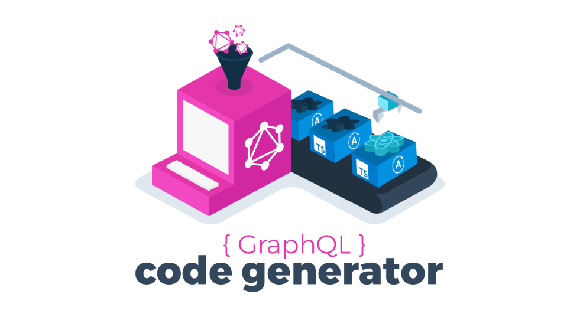

GatsbyでTypeScriptを使うとGraphQLクエリ部分の型定義が大変....

そもそもGraphQLスキーマに型が定義されているのにTypeScriptで型定義をするのは二重定義になってしまってイケてない

そんなときにTypeScriptの型定義を自動生成をしてくれる「[GraphQL Code Generator](https://graphql-code-generator.com/)」が幸せな気持ちにさせてくれた

## GraphQL Code Generator


GraphQL Code GeneratorはGraphQLスキーマまたはGraphQLドキュメント(Query/Mutation/Subscription/Fragment)からTypeScriptの型定義を自動生成してくれるCLIツール。

GatsbyではGraphQLスキーマを自動生成してくれているので非常に相性が良い。使わない手はないぜって感じ


## 使いかた

#### インストール
まず、CLIと依存するパッケージをインストール
```bash:title=bash
yarn add -D @graphql-codegen/cli @graphql-codegen/typescript @graphql-codegen/typescript-operations
```

`@graphql-codegen/typescript-operations`はデベロッパが定義したQuery等のGraphQLドキュメントを元に型を生成してくれるプラグイン

他にも

- `@graphql-codegen/typescript-resolvers` - resolve関数の型を生成
- `@graphql-codegen/typescript-mongodb` - MongoDBモデルを元に型を生成


といったプラグインが多くあり、[ここ](https://graphql-code-generator.com/docs/plugins/)に良い感じにプラグインがまとまってるので、気になるかたは参考にしてみるといいかも

#### 構成ファイル
次に構成ファイルのcodegen.ymlをプロジェクトに作成します。

構成ファイルは`codegen.yml`または`codegen.json`を自動検出してくれる

```yml:title=codegen.yml
overwrite: true
schema: "http://localhost:8000/___graphql"
documents:
  - "./node_modules/gatsby-*/**/*.js"
  - "./src/**/*.{ts,tsx}"
generates:
  src/graphqlTypes.ts: // 型定義ファイルを生成するパス
    plugins:
      - "typescript"
      - "typescript-operations"

```

また構成ファイルはCLIでも作成することができるのでお好きな方で！
```bash:title=bash
$ graphql-codegen init
```

#### npmスクリプトの設定
グローバルインストールしてCLIを直接使うこともできるが、npmスクリプトとして追加した方がグローバルインストールしなくて済むので登録していきます。

ちなみに公式もnpmスクリプトから呼び出すことをオススメしている

```json:title=package.json
{
  "scripts": {
    "gql-codegen": "graphql-codegen --config codegen.yml",
  }
}
```

`--config`オプションでconfigファイルを指定することができる。
前述の通り今回は指定しなくてもOK

#### 型定義ファイルの自動生成
 ```bash:title=bash
 $ yarn gql-codegen
 ```

あとはサーバ起動時に上記コマンドを実行することでGraphQLスキーマを元に今回の設定だと`graphqlTypes.ts`という型定義ファイルができる🎉

## 結果
実際に使ってみると`@graphql-codegen/typescript-operations`を使用しているので以下の例だとPostsクエリを元に`PostsQuery`という型ができている！

これで幸せになれました☺️

```tsx:title=HogePero.tsx
import React from 'react'
import { graphql } from 'gatsby'

import { PostsQuery } from '../graphqlTypes'

import Article from '../components/Article'

type Props = {
  data: PostsQuery
}

const HogePero: React.FC<Props> = ({ data }) => (
  <>
    {data.allMarkdownRemark.edges.map(({ node }) => (
      <Article key={node.id} title={node.frontmatter.title} />
    ))}
  </>
)

export const query = graphql`
  query Posts {
    allMarkdownRemark(
      sort: { fields: [frontmatter___date], order: DESC }
    ) {
      edges {
        node {
          id
          frontmatter {
            title
          }
        }
      }
    }
  }
`

export default HogePero
```


#### さいごに
GraphQL Code GeneratorとGatsbyの組み合わせはサイコー

みんな幸せになってこうな
