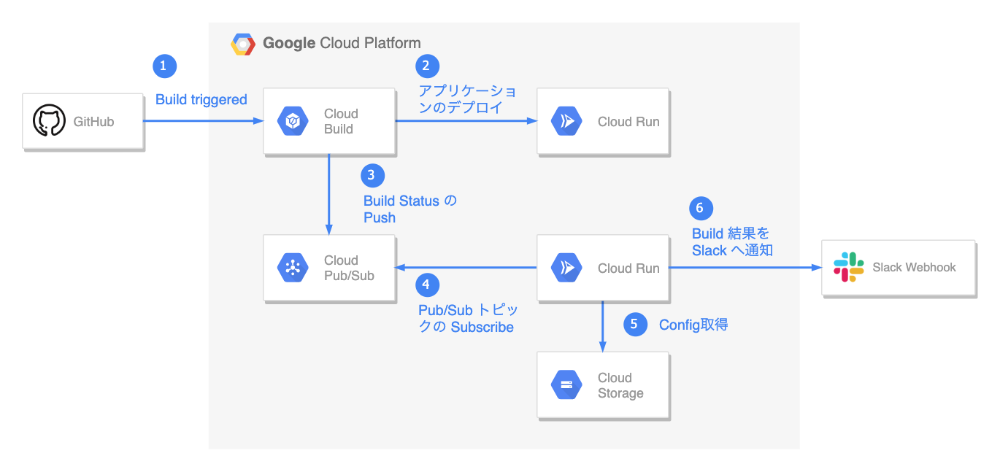

最近 Google Cloud Build のビルド結果を Slack に通知するということをやっていたが、ググったら古い情報が多かったので通知するためにやったことを記載します。

基本的にやったことは[公式ドキュメント](https://cloud.google.com/build/docs/configuring-notifications/configure-slack?hl=ja)に記載してある     [GoogleCloudPlatform/cloud-build-notifiers](https://github.com/GoogleCloudPlatform/cloud-build-notifiers) を使った通知ですが多少使いやすいように修正しています。

構成と通知までの流れは下図のようになります。




## 1. 始める前の準備

### gcloud configの設定
この記事を読んでいるということは既に gcloud コマンドが使えるような環境だとは思いますが、この後に実行する Shell で projectId が必要になるので gcloud config に project が設定されているか確認します

```console
$ gcloud config list
```

project に希望のGCPプロジェクト設定が設定されていれば OK です。
設定されていなければ、設定するかデフォルトのプロジェクトを切り替えてなどして対応してください。

```console
$ gcloud config set project <project name>
```

### Slack アプリの作成
[Slack アプリの作成](https://api.slack.com/apps?new_app=1) をして Webhook URL を発行してください。

ここの詳細は必要ないと思うので省きます。

### Slack Notifier の clone
GitHub から 公式が提供している [GoogleCloudPlatform/cloud-build-notifiers](https://github.com/GoogleCloudPlatform/cloud-build-notifiers) を clone します。

ちなみに今回紹介するバージョンは `slack-1.11.0` です。時間経過で方法や内容が変わっている場合があります。


```console
$ git clone git@github.com:GoogleCloudPlatform/cloud-build-notifiers.git
```


## 2. Slack Notifier のデプロイ

#### config ファイルの作成
まずはじめに config ファイルの作成をします。 `./slack/slack.yaml.example` があるのでそれをコピーして使います。

```console
$ cp ./slack/slack.yaml.example ./slack/slack.yaml
```

コピーすると下記のような内容のファイルができていると思います。

```yaml:title=./slack/slack.yaml
# Copyright 2020 Google LLC
#
# Licensed under the Apache License, Version 2.0 (the "License");
# you may not use this file except in compliance with the License.
# You may obtain a copy of the License at
#
#      http://www.apache.org/licenses/LICENSE-2.0
#
# Unless required by applicable law or agreed to in writing, software
# distributed under the License is distributed on an "AS IS" BASIS,
# WITHOUT WARRANTIES OR CONDITIONS OF ANY KIND, either express or implied.
# See the License for the specific language governing permissions and
# limitations under the License.

apiVersion: cloud-build-notifiers/v1
kind: SlackNotifier
metadata:
  name: example-slack-notifier
spec:
  notification:
    filter: build.status == Build.Status.SUCCESS
    delivery:
      webhookUrl:
        secretRef: webhook-url
  secrets:
  - name: webhook-url
    value: projects/example-project/secrets/example-slack-notifier-webhook-url/versions/latest

```


#### Secret Manager への登録
Slack Webhook URLを Secret Manager から参照するため URL をシークレットに登録します。

シークレットに登録したら GCPプロジェクトに関連づけられている Compute Engine のデフォルトのサービスアカウントへシークレットのアクセス権を付与し通知アプリケーションから参照できるようにします。

下記のような形式
```
<project-number-compute>@developer.gserviceaccount.com
```
ロールは Secret Manager のシークレットアクセサーを選択します。


#### config ファイルの修正
Secret Manager への登録が終わったら config ファイルの修正をします。
先ほど登録したシークレットのリソース ID とついでに metadata を修正します

```diff:title=./slack/slack.yaml
apiVersion: cloud-build-notifiers/v1
kind: SlackNotifier
metadata:
-  name: example-slack-notifier
+  name: cloudbuild-slack-notifier
spec:
  notification:
    filter: build.status == Build.Status.SUCCESS
    delivery:
      webhookUrl:
        secretRef: webhook-url
  secrets:
  - name: webhook-url
-    value: projects/example-project/secrets/example-slack-notifier-webhook-url/versions/latest
+    value: projects/<プロジェクトID>/secrets/<シークレット名>/versions/<バージョン>
```

上記の設定だと Cloud Build のステータスが成功した場合にしか Slack へ通知が送られませんが全ての Build ステータスを通知する場合は filter を修正します。

```diff:title=./slack/slack.yaml
apiVersion: cloud-build-notifiers/v1
kind: SlackNotifier
metadata:
  name: cloudbuild-slack-notifier
spec:
  notification:
-    filter: build.status == Build.Status.SUCCESS
+    filter: true
    delivery:
      webhookUrl:
        secretRef: webhook-url
  secrets:
  - name: webhook-url
    value: projects/<プロジェクトID>/secrets/<シークレット名>/versions/<バージョン>
```

#### Setup シェルの修正
ここまでの修正でシェルを実行してデプロイしても大丈夫ですが、このまま Slack Notifier をデプロイすると Cloud Run のデフォルト設定の最大インスタンス数1000台まで自動スケールするようになってしまい少し気持ち悪いのでスケールできる最大数を設定します。

`deploy_notifier` 関数を修正し、最大1台までに設定しています。
```diff:title=setup.sh
deploy_notifier() {
  gcloud run deploy "${SERVICE_NAME}" \
    --image="${IMAGE_PATH}" \
    --no-allow-unauthenticated \
+    --max-instances=1 \
    --update-env-vars="CONFIG_PATH=${DESTINATION_CONFIG_PATH},PROJECT_ID=${PROJECT_ID}" ||
    fail "failed to deploy notifier service -- check service logs for configuration error"
}
```


#### Setup シェルの実行
すべての設定が完了したので setup シェルを実行します。

`<シークレット名>` には Secret Manager に登録した Slack Webhook URL にシークレット名を指定します。

```console
$ ./setup.sh slack ./slack/slack.yaml <シークレット名>
```

いくつかの対話シェルへ入力し、以下のように最後に出力されれば成功です。

```console
+ echo '** NOTIFIER SETUP COMPLETE **'
** NOTIFIER SETUP COMPLETE **
```

これで Cloud Build のステータスが Slack へ通知されるようになります。
あとはSlack アプリにアイコンをするなりすると良い感じで通知されます。


## 3. おまけ

Cloud Run へのデプロイに失敗すると下記のようなエラーがでますが、エラーメッセージに書かれているような Port が全く関係ないことが多いので、素直に Cloud Run のログを確認すると良いです。

```console
Deployment failed                                                                                                                                                                                               
ERROR: (gcloud.run.deploy) Cloud Run error: Container failed to start. Failed to start and then listen on the port defined by the PORT environment variable. Logs for this revision might contain more information.
```


